# 🛡️ Awesome Model Risk Management & AI Governance ⚖️

  

  
  
  
  

> **A curated ecosystem of enterprise SaaS platforms, open-source frameworks, and tools for AI Governance, Model Risk Management (MRM), Model Inventory, Bias & Fairness, Drift Monitoring, Explainability (XAI), Validation, and Regulatory Compliance (EU AI Act, NIST AI RMF, SR 11-7).**

---

## 📚 Table of Contents
- [🌐 SaaS / Enterprise Hosted Platforms](#-saas--enterprise-hosted-platforms)
- [🔓 Open-Source GitHub Projects](#-open-source-github-projects)
- [💡 Additional Open-Source Options & Architectures](#-additional-open-source-options--architectures)
- [🤝 How to Contribute](#-how-to-contribute)
- [💖 Support & Community](#-support--community)
- [📈 Star History](#-star-history)
- [⚠️ Disclaimer](#-disclaimer)

---

## 🌐 SaaS / Enterprise Hosted Platforms

### 📊 Sector Overview & Market Dynamics
> **Estimated Market Size**: The Global AI Governance & Model Risk Management market is estimated at **$350M–$500M (2026)** and projected to reach **$2.5B+ by 2030** (CAGR ~35%), driven by strict enforcement of the **EU AI Act**, **NIST AI RMF**, and global regulatory audits.
> 
> **Market Fragmentation**: The sector is **moderately fragmented**. Established legacy analytics leaders (IBM, SAS, DataRobot) compete alongside high-growth specialized AI risk and observability platforms (ModelOp, Fiddler, Arthur, Holistic AI). The market is rapidly evolving as enterprise system-of-record demands increase.

### 🏢 SaaS Product Comparison Matrix
*Products are sorted by estimated company size / valuation / enterprise scale (descending).*

| Product 🏢 | Description 📝 | Company Scale / Valuation 💰 | Starting Tier Price 💳 | Free Tier / Free Trial Limits 🎁 |
| :--- | :--- | :--- | :--- | :--- |
| **[IBM watsonx.governance](https://www.ibm.com/watsonx)** | Comprehensive enterprise AI governance module for factsheets, risk workflows, and EU AI Act compliance. | **$130B+** (Market Cap) | **$1,500 / month** (Essentials Plan) | 30-day Free Trial (up to $200 free cloud credits) |
| **[SAS Model Manager](https://www.sas.com/)** | Enterprise-grade model management, lifecycle validation, and audit controls for regulated financial institutions. | **$3.2B+** (Annual Revenue) | **$10,000 / year** (Starting tier) | 14-day Free Software Trial (hosted environment) |
| **[DataRobot AI Governance](https://www.datarobot.com/)** | End-to-end model governance, compliance oversight, and lifecycle monitoring integrated with DataRobot platform. | **$3.0B+** (Valuation) | **$25,000 / year** (Starter package) | 14-day Free SaaS Trial |
| **[Truera](https://www.datarobot.com/)** *(Acquired by DataRobot)* | Model quality, explainability, and debugging technology integrated into enterprise AI governance stack. | **$3.0B+** *(Acquired)* | **Included with DataRobot enterprise tier** | 14-day Free Trial via DataRobot platform |
| **[Fiddler AI](https://www.fiddler.ai/)** | AI observability and risk management platform specializing in LLM monitoring, explainability, and drift detection. | **$300M+** (Valuation) | **$500 / month** (Developer Tier) | 14-day Free Trial (up to 1M model predictions) |
| **[ModelOp](https://www.modelop.com/)** | Specialized enterprise governance system-of-record for model inventory, lifecycle controls, and regulatory audit readiness. | **$150M+** (Valuation) | **$30,000 / year** (Enterprise starter) | 30-day Enterprise Proof-of-Concept / Guided Sandbox |
| **[Arthur AI](https://www.arthur.ai/)** | Model monitoring, performance engine, and guardrails for machine learning and generative AI models. | **$100M+** (Valuation) | **$250 / month** (Pro Tier) | Free Developer Tier (1 model, up to 10,000 inferences/mo) |
| **[Holistic AI](https://www.holisticai.com/)** | Enterprise AI governance, audit, and risk mitigation software tailored for EU AI Act compliance. | **$50M+** (Valuation) | **$1,000 / month** (SMB Governance tier) | 14-day Free Governance Assessment Trial |
| **[Monitaur](https://monitaur.ai/)** | Audit-ready AI risk management platform designed for insurance and regulated industries. | **$30M+** (Valuation) | **$800 / month** (Base Compliance Package) | 14-day Free Audit Sandbox Trial |
| **[FairNow](https://www.fairnow.ai/)** | AI bias detection, fairness governance, and compliance management platform for enterprise HR and finance. | **$15M+** (Valuation) | **$300 / month** (Starter Tier) | 14-day Free Trial (1 model, bias scan included) |

---

## 🔓 Open-Source GitHub Projects

Below are key open-source building blocks for model risk management, fairness, explainability, and monitoring.

*Sorted by GitHub Stars_Count (descending).*

- **[SHAP](https://github.com/shap/shap)**   
  Game-theoretic approach (SHapley Additive exPlanations) to explain the output of any machine learning model.

- **[Great Expectations](https://github.com/great-expectations/great_expectations)**   
  Data validation and profiling framework to maintain data quality in model training and inference pipelines.

- **[Evidently](https://github.com/evidentlyai/evidently)**   
  Open-source ML and LLM observability library for data drift, performance tracking, model metrics, and interactive dashboards.

- **[InterpretML](https://github.com/interpretml/interpret)**   
  Toolkit for training interpretable glassbox models and explaining blackbox machine learning systems.

- **[AI Fairness 360 (AIF360)](https://github.com/Trusted-AI/AIF360)**   
  IBM's comprehensive open-source Python toolkit for detecting and mitigating discrimination and bias in machine learning models.

- **[Fairlearn](https://github.com/fairlearn/fairlearn)**   
  Python library for assessing model fairness and mitigating bias across demographics.

- **[Alibi Detect](https://github.com/SeldonIO/alibi-detect)**   
  Algorithms for outlier, adversarial, and concept drift detection in tabular, text, and image data.

- **[Alibi Explain](https://github.com/SeldonIO/alibi)**   
  Python library algorithms for black-box, white-box, counterfactual, and anchor model explanations.

- **[WhyLogs](https://github.com/whylabs/whylabs-processing-core)**   
  Open-source data profiling library for tracking statistical properties of datasets and ML models in production.

- **[Deepchecks](https://github.com/deepchecks/deepchecks)**   
  Continuous validation and testing framework for machine learning models and data across data integrity, model performance, and data drift.

- **[Giskard](https://github.com/Giskard-AI/giskard)**   
  Open-source QA, security, and vulnerability testing framework for LLMs and tabular AI models.

- **[TruLens](https://github.com/truera/trulens)**   
  Evaluation and tracking instrumentation for LLM applications and RAG chains.

---

## 💡 Additional Open-Source Options & Architectures

- 🛠️ **Fairness Stack**: Combine **Fairlearn + AIF360** for pre-production fairness audits, demographic parity tests, and bias mitigation algorithms.
- 👁️ **Observability Stack**: Combine **Evidently + Alibi + SHAP** for real-time inference monitoring, data drift alert rules, and feature attribution explanations.
- 📜 **Documentation & Metadata**: Utilize automated model-card and datasheet generators as lightweight governance repositories.
- 🏢 **Enterprise Hybrid Approach**: Open-source tools provide runtime metrics and evaluation libraries, which feed into enterprise MRM system-of-record platforms (ModelOp, IBM watsonx, Fiddler) for cross-organizational audit trails and compliance reporting.

---

## 🤝 How to Contribute

Contributions are welcome! Help build the definitive Model Risk Management resource:

1. 🍴 **Fork** the repository.
2. 📝 **Add/edit** entries in `README.md` following the established tabular and list structures.
3. 📌 **Provide Details**: Ensure company scale, pricing, free trial specs, or repo Stars_Badges are included accurately.
4. 🚀 **Submit PR**: Open a pull request with a concise summary of updates.

Please check out our list of awesome resources at [Awesome-Awesome-Awesome](https://github.com/ishandutta2007/Awesome-Awesome-Awesome)!

---

## 💖 Support & Community

If you find this repository valuable for your AI Governance, MRM research, or enterprise risk strategy, please support the project:

- ⭐ **Star this repository** to increase visibility on GitHub.
- 🔀 **Fork & Share** with Model Risk Officers, AI Ethicists, and ML Engineers.
- ☕ **Sponsor the Maintainer**: Consider supporting further open-source research via the [GitHub Sponsor Dashboard](https://github.com/sponsors/ishandutta2007).

---

## 📈 Star History

---

## ⚠️ Disclaimer

- This repository is a **community-curated index** for informational and educational purposes.
- Model Risk Management (MRM) and AI Governance involve complex regulatory frameworks (e.g., EU AI Act, NIST AI RMF, Federal Reserve SR 11-7). Open-source software tools alone do not constitute legal or regulatory compliance without appropriate enterprise governance policies, human oversight, and audit procedures.

---

**Crafted with ❤️ for Model Risk Officers, AI Governance Leads, and ML Engineers.**
